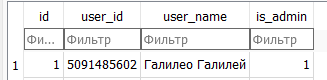
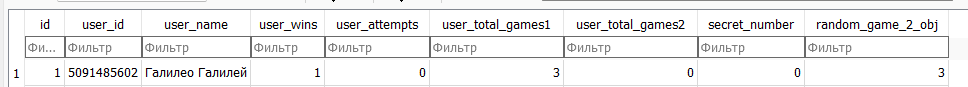

# Charles_Smith

---

- Данный бот создан как дипломный проект, и имеет в себе несколько миниигр, а также может показывать погоду в вашем городе через API сервис OpenWeather.

- У бота есть взаимодействие с базой данных (профиль пользователя и информация, накопленная о нём в боте сохраняется.), а также StatesGroup.(Состояния использовались лишь в пару хэндлерах, потому что большинство взаимодействия у меня по кнопкам.)

- Происходит постоянное логирование всех действий сообщений пользователей.

- Также в боте есть простенькая админ-панель, которая показывает небольшую статистику о боте. Чтобы быть админом, в базе данных значение вашего пользователя is_admin должно быть = 1

- У пользователя есть и игровая статистика, которая заносится уже в другую таблицу базы данных:

